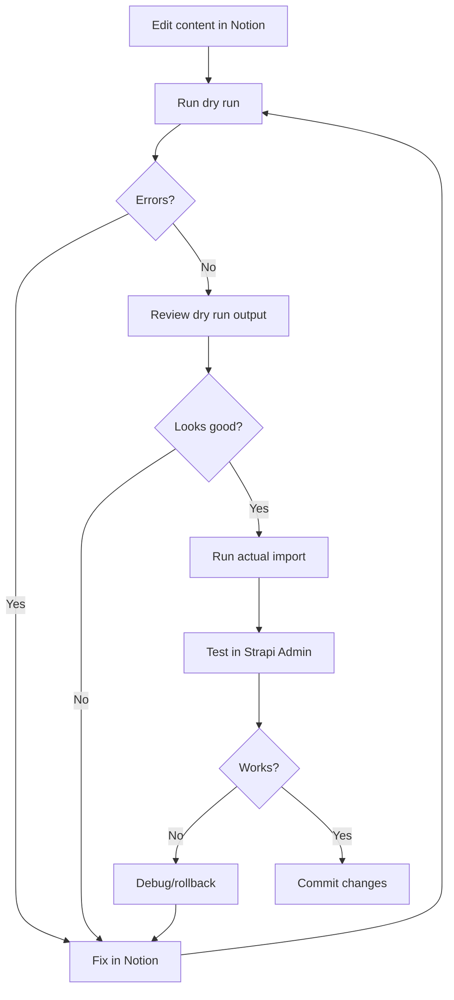

# Notion → Strapi Sync Guide

Complete guide for syncing canon content from Notion to Strapi backend.

## Table of Contents

1. [Quick Start](#quick-start)
2. [Prerequisites](#prerequisites)
3. [Setup](#setup)
4. [Usage](#usage)
5. [Workflow](#workflow)
6. [Troubleshooting](#troubleshooting)

---

## Quick Start

**Get your first sync running in 5 minutes:**

```bash
# 1. Set up environment variables
cd ruach-ministries-backend
cp .env.example .env  # If needed
# Edit .env and add Notion credentials

# 2. Preview what would be imported (dry run)
npx tsx scripts/import-from-notion.ts --dry-run

# 3. Actually import the data
npx tsx scripts/import-from-notion.ts
```

---

## Prerequisites

### Required

- ✅ Notion account with a database containing canonical content
- ✅ Notion API integration with access to your database
- ✅ Strapi backend running (locally or remote)
- ✅ Strapi API token with write permissions
- ✅ Node.js 18+ and pnpm installed

### Optional but Recommended

- ✅ Git repository to track changes
- ✅ Backup of Strapi database before first sync

---

## Setup

### Step 1: Create Notion Integration (2 minutes)

1. Go to [https://www.notion.so/my-integrations](https://www.notion.so/my-integrations)
2. Click **"+ New integration"**
3. Name: `Ruach Canon Sync`
4. Associated workspace: Select your workspace
5. Capabilities needed:
   - ✅ Read content
   - ✅ Read comments (optional)
   - ❌ No user information needed
6. Click **"Submit"**
7. **Copy the "Internal Integration Token"** (begins with `secret_` prefix followed by 40 characters)

### Step 2: Share Database with Integration (1 minute)

1. Open your canon database in Notion
2. Click **"Share"** button (top right)
3. Click **"Invite"**
4. Search for your integration name (`Ruach Canon Sync`)
5. Grant **"Can view"** permission (minimum)
6. Click **"Invite"**

### Step 3: Get Database ID (30 seconds)

1. Open your database in Notion
2. Look at the URL in your browser:
   ```
   https://www.notion.so/workspace/32charsOfDatabaseID?v=viewID
                                   ^^^^^^^^^^^^^^^^^^^^
   ```
3. Copy the 32-character database ID

### Step 4: Get Strapi API Token (1 minute)

#### If you have an existing token:
Skip to Step 5

#### Create new token:

1. Start Strapi:
   ```bash
   cd ruach-ministries-backend
   pnpm develop
   ```

2. Open Strapi Admin: http://localhost:1337/admin

3. Navigate to: **Settings → API Tokens → Create new API Token**

4. Configure:
   - **Name:** `Notion Import Script`
   - **Token duration:** `Unlimited` or `90 days`
   - **Token type:** `Full access` (or custom with create/update permissions)

5. Click **"Save"**

6. **Copy the token immediately** (you won't see it again!)

### Step 5: Configure Environment Variables (1 minute)

Edit `ruach-ministries-backend/.env`:

```bash
# Notion Configuration
NOTION_API_KEY=<YOUR_NOTION_API_KEY>
NOTION_DATABASE_ID=<YOUR_NOTION_DATABASE_ID>

# Strapi Configuration
STRAPI_URL=http://localhost:1337
STRAPI_API_TOKEN=<YOUR_STRAPI_API_TOKEN>
```

**Production example:**
```bash
NOTION_API_KEY=<YOUR_NOTION_API_KEY>
NOTION_DATABASE_ID=<YOUR_NOTION_DATABASE_ID>
STRAPI_URL=https://api.joinruach.org
STRAPI_API_TOKEN=<YOUR_PRODUCTION_API_TOKEN>
```

---

## Usage

### Preview Changes (Dry Run) - Recommended First Step

```bash
npx tsx scripts/import-from-notion.ts --dry-run
```

**What it does:**
- ✅ Exports data from Notion
- ✅ Validates against Canon Law rules
- ✅ Shows what would be created/updated
- ❌ Does NOT actually write to Strapi

**Expected output:**
```
🔄 Notion → Strapi Import
📍 Strapi URL: http://localhost:1337

━━━━━━━━━━━━━━━━━━━━━━━━━━━━━━━━━━━━━━━━━━━━━━━━━━━━━━━━━━
Step 1: Exporting from Notion
━━━━━━━━━━━━━━━━━━━━━━━━━━━━━━━━━━━━━━━━━━━━━━━━━━━━━━━━━━
✅ Fetched 47 nodes from Notion database
✅ Exported 47 nodes to scripts/canon-audit/data/notion-export.json

━━━━━━━━━━━━━━━━━━━━━━━━━━━━━━━━━━━━━━━━━━━━━━━━━━━━━━━━━━
Step 2: Validating Canon Alignment
━━━━━━━━━━━━━━━━━━━━━━━━━━━━━━━━━━━━━━━━━━━━━━━━━━━━━━━━━━
✅ Validation passed: 45 safe, 2 warnings

━━━━━━━━━━━━━━━━━━━━━━━━━━━━━━━━━━━━━━━━━━━━━━━━━━━━━━━━━━
Step 3: Importing to Strapi (DRY RUN)
━━━━━━━━━━━━━━━━━━━━━━━━━━━━━━━━━━━━━━━━━━━━━━━━━━━━━━━━━━

📘 Importing Formation Phases...
  [DRY RUN] Would upsert formation-phases: Awakening
  [DRY RUN] Would upsert formation-phases: Separation
  ...

📖 Importing Guidebook Nodes...
  [DRY RUN] Would upsert guidebook-nodes: What is Covenant?
  [DRY RUN] Would upsert guidebook-nodes: The Role of the Holy Spirit
  ...

💡 This was a dry run. Run without --dry-run to actually import data.
```

### Full Import (Production)

```bash
npx tsx scripts/import-from-notion.ts
```

**What it does:**
- ✅ Exports data from Notion
- ✅ Validates against Canon Law rules
- ✅ Creates new records in Strapi
- ✅ Updates existing records if content changed
- ✅ Skips unchanged records (checksum comparison)

**Expected output:**
```
━━━━━━━━━━━━━━━━━━━━━━━━━━━━━━━━━━━━━━━━━━━━━━━━━━━━━━━━━━
Step 3: Importing to Strapi
━━━━━━━━━━━━━━━━━━━━━━━━━━━━━━━━━━━━━━━━━━━━━━━━━━━━━━━━━━

📘 Importing Formation Phases...
  ✅ Created: Awakening
  ✅ Created: Separation
  ⏭️  Skipped (unchanged): Discernment

📖 Importing Guidebook Nodes...
  ✅ Created: What is Covenant?
  🔄 Updated: The Role of the Holy Spirit
  ⏭️  Skipped (unchanged): Checkpoint: Your Covenant Commitment
  ...

════════════════════════════════════════════════════════════
IMPORT SUMMARY
════════════════════════════════════════════════════════════

📘 Formation Phases:
  ✅ Created: 2
  🔄 Updated: 1
  ⏭️  Skipped: 2

📖 Guidebook Nodes:
  ✅ Created: 15
  🔄 Updated: 8
  ⏭️  Skipped: 24

✅ Import complete!
```

### Skip Validation (Not Recommended)

```bash
npx tsx scripts/import-from-notion.ts --skip-validation
```

**⚠️ Warning:** This bypasses Canon Law validation. Only use if:
- You've already validated separately
- You're importing non-doctrinal content
- You're debugging import issues

---

## Workflow

### Recommended Development Workflow



### Step-by-Step

1. **Edit content in Notion**
   - Make changes to your canon database
   - Add new nodes, update existing content
   - Tag with proper phases and axioms

2. **Preview the sync**
   ```bash
   npx tsx scripts/import-from-notion.ts --dry-run
   ```

3. **Fix any validation errors**
   - If Canon Law violations found, fix in Notion
   - Re-run dry run until clean

4. **Import to Strapi**
   ```bash
   npx tsx scripts/import-from-notion.ts
   ```

5. **Verify in Strapi Admin**
   - Open http://localhost:1337/admin
   - Navigate to Content Manager → Guidebook Nodes
   - Spot-check imported content

6. **Test on frontend**
   - Start Next.js app
   - Navigate to formation pages
   - Verify content displays correctly

7. **Commit changes**
   ```bash
   git add .
   git commit -m "sync: Import canon content from Notion"
   git push
   ```

### Production Deployment Workflow

```bash
# 1. Run dry run against production
STRAPI_URL=https://api.joinruach.org \
STRAPI_API_TOKEN=<prod-token> \
npx tsx scripts/import-from-notion.ts --dry-run

# 2. Review output carefully

# 3. Backup production database (just in case)
# See your hosting provider's backup docs

# 4. Run actual import
STRAPI_URL=https://api.joinruach.org \
STRAPI_API_TOKEN=<prod-token> \
npx tsx scripts/import-from-notion.ts

# 5. Verify on production site
open https://joinruach.org/formation/awakening
```

---

## Troubleshooting

### "Missing required environment variables"

**Problem:**
```
Missing required environment variables: NOTION_API_KEY and NOTION_DATABASE_ID
Add them to your .env file or export them in your shell.
```

**Solution:**
1. Check `.env` file exists in `ruach-ministries-backend/`
2. Verify `NOTION_API_KEY` and `NOTION_DATABASE_ID` are set
3. Restart your terminal if you just added them

### "Canon validation failed: X critical errors found"

**Problem:**
```
❌ Canon validation failed: 3 critical errors found
Fix errors in Notion before importing. Run: tsx scripts/canon-audit/index.ts
```

**Solution:**
1. Run the full audit to see details:
   ```bash
   npx tsx scripts/canon-audit/index.ts
   ```
2. Review the generated report in `scripts/canon-audit/reports/`
3. Fix the errors in Notion
4. Re-run the import

**Common validation errors:**
- **Grace without cost:** Add foundational teaching on sacrifice/cost before emphasizing grace
- **Warfare without identity:** Ensure identity in Christ is established before warfare topics
- **Phase progression:** Move advanced concepts to later phases

### "Could not find database" / "API request failed"

**Solutions:**
- Verify database ID is correct (32 characters, no dashes)
- Ensure integration has access (check Share settings in Notion)
- Confirm integration has "Read content" permission
- Check API key is valid (begins with `secret_` prefix)
- Verify internet connection

### Records not updating

**Problem:**
Script says "Skipped (unchanged)" but you know content changed.

**Possible causes:**
1. **Checksum collision** (rare) - Delete the record in Strapi and re-import
2. **Cached export** - Delete `scripts/canon-audit/data/notion-export.json` and re-run
3. **Different Notion page** - Verify you're editing the correct database

**Solution:**
```bash
# Force fresh export
rm scripts/canon-audit/data/notion-export.json
npx tsx scripts/import-from-notion.ts
```

### "Validation Error: Axiom hierarchy validation failed"

**Problem:**
Import succeeds but Strapi rejects the record due to lifecycle hook validation.

**Explanation:**
The lifecycle hooks in Strapi enforce Canon Law rules at write time. This is your last line of defense.

**Solution:**
1. Check the error details in Strapi logs
2. Fix the axiom tier issue in Notion
3. Re-import

**Example error:**
```json
{
  "node": {
    "title": "Spiritual Warfare Basics",
    "type": "Warfare"
  },
  "violations": [
    {
      "code": "INSUFFICIENT_GOVERNING_TIER",
      "message": "Node Type 'Warfare' requires at least Tier 1, but highest tier present is Tier 2"
    }
  ]
}
```

### Script hangs or times out

**Possible causes:**
- Large database (100+ nodes)
- Slow network connection
- Strapi not responding

**Solutions:**
```bash
# 1. Use cached export (skip Notion fetch)
npx tsx scripts/import-from-notion.ts --skip-export

# 2. Check Strapi is running
curl http://localhost:1337/_health

# 3. Increase Node.js memory if needed
NODE_OPTIONS="--max-old-space-size=4096" npx tsx scripts/import-from-notion.ts
```

---

## Advanced Usage

### Custom Strapi URL

```bash
STRAPI_URL=https://api.joinruach.org npx tsx scripts/import-from-notion.ts
```

### Import specific phase only

Currently not supported - modify script or filter in Notion database view.

### Automated syncs

Add to cron:
```bash
# Daily sync at 3am
0 3 * * * cd /path/to/ruach-ministries-backend && npx tsx scripts/import-from-notion.ts >> logs/notion-sync.log 2>&1
```

Add to CI/CD (GitHub Actions):
```yaml
- name: Sync Notion Content
  run: |
    cd ruach-ministries-backend
    npx tsx scripts/import-from-notion.ts
  env:
    NOTION_API_KEY: ${{ secrets.NOTION_API_KEY }}
    NOTION_DATABASE_ID: ${{ secrets.NOTION_DATABASE_ID }}
    STRAPI_URL: ${{ secrets.STRAPI_URL }}
    STRAPI_API_TOKEN: ${{ secrets.STRAPI_API_TOKEN }}
```

---

## Related Documentation

- **Canon Audit System:** `scripts/canon-audit/README.md`
- **Quick Start Guide:** `scripts/canon-audit/QUICKSTART.md`
- **Axiom Validator:** `docs/AXIOM-VALIDATOR-DEPLOYMENT.md`
- **Schema Definitions:** `src/api/guidebook-node/content-types/guidebook-node/schema.json`

---

**Questions or issues?** Open an issue in the repository or consult the Canon Audit README.
